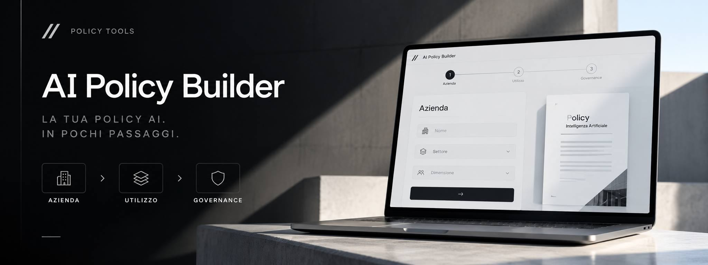

# AI Policy Builder



**La tua policy AI. In pochi passaggi.**

Generatore gratuito di una prima bozza di policy interna sull'utilizzo dell'intelligenza artificiale, progettato per professionisti, imprenditori e organizzazioni italiane.

### ▶ [USA AI POLICY BUILDER ONLINE](https://emaf205.com/ideas/ai-policy-builder/)

**3 passaggi · Nessuna registrazione · Elaborazione locale · Documento da validare**

[Policy Tools](https://emaf205.com/ideas/policy-tools/) · [LinkedIn](https://www.linkedin.com/in/emanuelebdc)

---

## Cosa fa

1. **Azienda** — raccoglie le informazioni essenziali sull'organizzazione.
2. **Utilizzo dell'AI** — strumenti, attività, dati e casi d'uso da approfondire.
3. **Governance** — ruoli, controlli, formazione e revisione.

Il risultato è una **bozza strutturata, modificabile ed esportabile**. Le informazioni mancanti vengono indicate come **DA DEFINIRE**: l'app non inventa decisioni aziendali.

## Anteprima

La copertina mostra la direzione visiva del prodotto. Per vedere l'interfaccia aggiornata e il risultato completo usa la versione online.

### [Apri l'app →](https://emaf205.com/ideas/ai-policy-builder/)

## Esempio di risultato

La landing mostra un'anteprima delle sezioni prodotte. Al termine della compilazione puoi rivedere, modificare ed esportare la policy, quindi condividere lo strumento o contattare l'autore.

## Funzionalità

- Un unico `index.html`: nessun framework, backend, account o API necessari.
- Interfaccia responsive e percorso guidato in 3 passaggi.
- Anteprima del risultato prima della compilazione.
- Documento articolato in 14 sezioni con checklist finale.
- Modifica del testo prima dell'esportazione.
- **PDF A4** tramite stampa browser.
- Download **Word (.docx), Markdown (.md), TXT, HTML ed email (.eml)**.
- Pulsanti di condivisione riferiti allo **strumento**, non ai dati aziendali.
- Le risposte vengono elaborate nel browser; l'app non le invia a un server.
- Supporto a `prefers-reduced-motion`.

> **BOZZA NON APPROVATA.** AI Policy Builder non svolge un audit legale e non certifica la conformità dell'organizzazione. Il documento deve essere verificato, integrato e approvato in base ai processi reali, ai fornitori utilizzati e agli obblighi applicabili.

## Usa l'app

**URL ufficiale:**  
https://emaf205.com/ideas/ai-policy-builder/

Per uso locale, scarica `index.html` e aprilo in un browser moderno.

## Pubblicazione FTP

Carica `index.html` e `og.jpg` in:

```text
/ideas/ai-policy-builder/
```

Nel pacchetto FTP `og.jpg` è già posizionato accanto a `index.html`.

## Fonti istituzionali

I riferimenti integrati sono punti di partenza e non una dichiarazione automatica di conformità:

- [AI Act — Regolamento (UE) 2024/1689](https://eur-lex.europa.eu/eli/reg/2024/1689)
- [GDPR — Regolamento (UE) 2016/679](https://eur-lex.europa.eu/eli/reg/2016/679/oj)
- [Legge italiana 132/2025](https://www.gazzettaufficiale.it/eli/id/2025/09/25/25G00143/sg)
- [Garante per la protezione dei dati personali](https://www.garanteprivacy.it/)

## Autore

**Emanuele BDC**  
Docente e consulente specializzato in AI generativa, formazione e applicazioni aziendali.

[Entriamo in contatto su LinkedIn →](https://www.linkedin.com/in/emanuelebdc)

*Made with ♥ in Milan by Emanuele BDC.*

## Licenza

Copyright © 2026 Emanuele Barboni Dalla Costa (Emanuele BDC). **All Rights Reserved.**

Il codice e gli asset sono pubblici per consultazione, ma questa repository **non è open source**. Copia, modifica, redistribuzione, hosting o creazione di opere derivate richiedono autorizzazione scritta.

Vedi [LICENSE](LICENSE).
