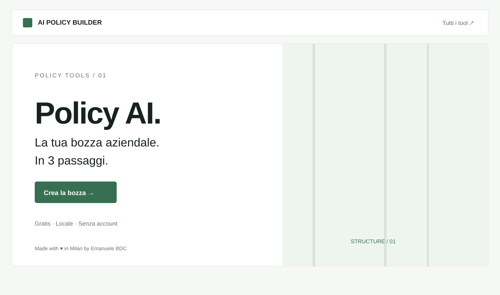
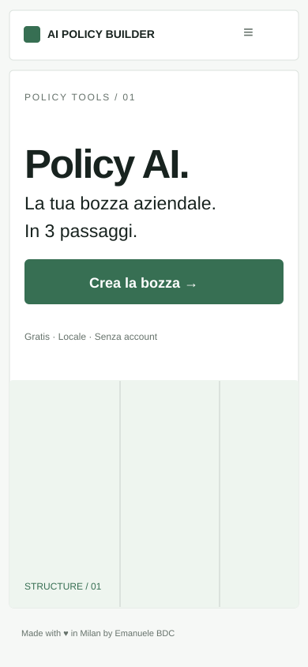

# AI Policy Builder



**Policy AI. La tua bozza aziendale. In 3 passaggi.**

Una web app gratuita, in italiano, per preparare una prima bozza di policy interna sull’utilizzo dell’intelligenza artificiale. Progettata per professionisti, imprenditori e organizzazioni. Nessuna registrazione, API o database.

**[Policy Tools — altri strumenti gratuiti](https://emaf205.com/ideas/policy-tools/)** · **[Demo sul sito (dopo la pubblicazione)](https://emaf205.com/ideas/policy-tools/policy-builder/)**

## Anteprima grafica

| Desktop | Smartphone |
|---|---|
|  |  |

*Le immagini sono rappresentazioni schematiche dell’interfaccia; per l’app reale apri `index.html`.*

## Come funziona

1. **Azienda** — ragione sociale, settore, dimensione.
2. **Uso dell’AI** — strumenti, attività, dati e casi da approfondire.
3. **Governance** — ruoli, responsabilità, verifiche e formazione.

Il documento risultante propone regole operative, gestione dei dati, supervisione, segnalazioni, revisione e checklist prima dell’adozione. I campi mancanti restano **DA DEFINIRE**.

L’interfaccia è essenziale, ma il documento è articolato: **14 sezioni operative, allegati e riferimenti istituzionali**.

## Funzionalità

- **Un file HTML**: può essere aperto localmente, senza installazione.
- Layout mobile-first, avanzamento visibile, anteprima del documento su desktop.
- Modifica del testo prima di esportare.
- **Word (.docx), Markdown (.md), TXT, HTML, email (.eml)**.
- **PDF A4** tramite la funzione di stampa del browser («Salva come PDF»).
- Collegamenti per condividere *lo strumento*, non le risposte aziendali.
- Nessuna chiamata API per elaborare il questionario; nessuna risposta inviata dall’app a un server.

> **BOZZA NON APPROVATA.** L’app non certifica la conformità di un’organizzazione. Il testo deve essere controllato, integrato e approvato in base ai processi reali, ai contratti dei fornitori, alla normativa applicabile e alla documentazione privacy aziendale.

## Utilizzo e pubblicazione

Per provare l’app: apri `index.html` in un browser moderno. Puoi anche caricarlo su un normale hosting statico.

Per il sito Emanuele BDC: carica `index.html` e `assets/og.png` in:

```text
/ideas/policy-tools/policy-builder/
```

Il link pubblico è già configurato nei metadati social e nei pulsanti di condivisione. **La condivisione del link funziona correttamente dopo la pubblicazione su quell’indirizzo**. L’app non effettua salvataggi automatici: esporta il documento prima di chiudere.

## Riferimenti

I testi richiamano, tra le altre, le seguenti fonti istituzionali; è necessario verificare la versione vigente prima dell’adozione:

- [AI Act — Reg. (UE) 2024/1689, testo consolidato](https://eur-lex.europa.eu/eli/reg/2024/1689)
- [GDPR — Reg. (UE) 2016/679](https://eur-lex.europa.eu/eli/reg/2016/679/oj)
- [Legge italiana 132/2025](https://www.gazzettaufficiale.it/eli/id/2025/09/25/25G00143/sg)
- [Garante per la protezione dei dati personali](https://www.garanteprivacy.it/)

## Autore

**Emanuele BDC** — docente e consulente specializzato in AI generativa e applicazioni aziendali. [Entra in contatto su LinkedIn](https://www.linkedin.com/in/emanuelebdc).

*Made with ♥ in Milan by Emanuele BDC.*

### Codice e licenza

La repository contiene il codice sorgente per consultazione. **Non è stata ancora scelta una licenza di riutilizzo**: l’assenza di un file `LICENSE` non concede automaticamente autorizzazioni a copiare, modificare o ridistribuire il codice. Per accordi d’uso, contatta l’autore.