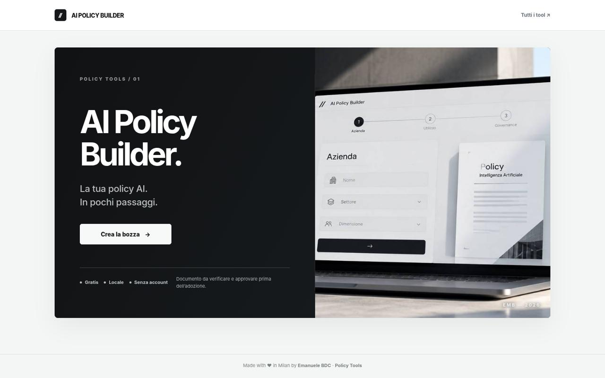
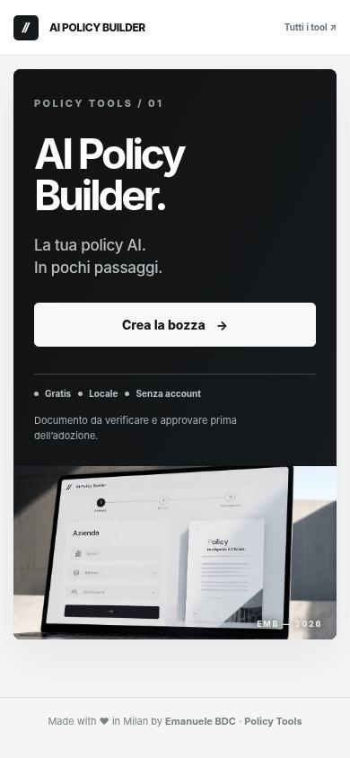
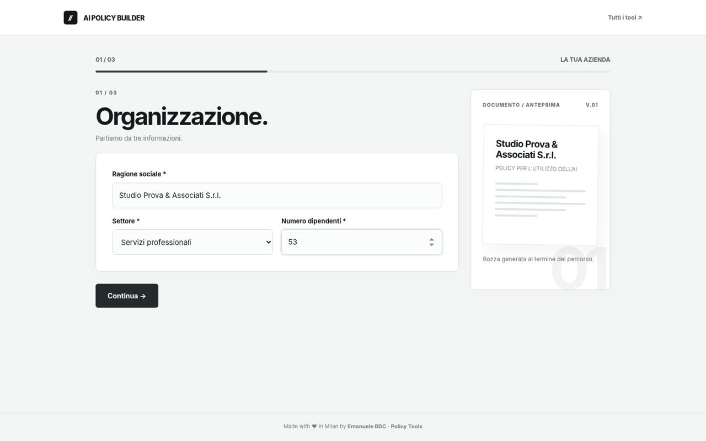

# AI Policy Builder


**La tua policy AI. In pochi passaggi.**

Generatore gratuito di una prima bozza di policy interna sull'utilizzo dell'intelligenza artificiale. Progettato per professionisti, imprenditori e organizzazioni italiane.

**3 passaggi · Senza registrazione · Elaborazione locale**

[**Policy Tools**](https://emaf205.com/ideas/policy-tools/) · [**Apri l'app**](https://emaf205.com/ideas/policy-tools/policy-builder/) *(quando pubblicata sul sito)*

## Anteprima reale

| Desktop | Smartphone |
|---|---|
|  |  |



## Come funziona

1. **Azienda:** ragione sociale, settore, numero di dipendenti.
2. **Utilizzo dell'AI:** strumenti, attività, dati e casi da approfondire.
3. **Governance:** ruoli, controlli, formazione e revisione.

Il risultato è una **bozza strutturata, modificabile ed esportabile**, con indicazioni operative, responsabilità e punti ancora **DA DEFINIRE**. Non vengono inventate informazioni mancanti.

## Funzionalità

- Un unico file HTML: niente framework, backend, account o API necessarie.
- Interfaccia responsive, navigazione guidata e animazioni rispettose di `prefers-reduced-motion`.
- Documento articolato in 14 sezioni, checklist e riferimenti istituzionali.
- Anteprima e modifica prima dell'esportazione.
- **PDF A4** tramite stampa browser; **Word (.docx), Markdown (.md), TXT, HTML, email (.eml)** scaricabili.
- Pulsanti social per condividere il link allo **strumento**, non i dati aziendali.
- Il questionario viene elaborato nel browser; l'app non trasmette le risposte a un server.

> **BOZZA NON APPROVATA.** Lo strumento non svolge un audit legale né certifica la conformità dell'azienda. Il documento richiede verifica, integrazione e approvazione in base ai processi, ai contratti dei fornitori e alla normativa applicabile.

## Avvio locale

Scarica `index.html` e aprilo in un browser moderno. Non è necessario installare librerie o avviare un server. Le risposte non vengono salvate automaticamente: esporta il documento prima di chiudere.

## Pubblicazione FTP

La versione pronta all'uso è nel pacchetto **V8-FTP**. Carica `index.html` e `og.jpg` in:

```text
/ideas/policy-tools/policy-builder/
```

La copertina GitHub (`assets/cover.jpg`) e le screenshot sono risorse della repository, non indispensabili per eseguire l'HTML. Il link di condivisione punta all'URL indicato sopra: diventa operativo dopo la pubblicazione.

## Fonti istituzionali

I riferimenti sono punti di partenza, non una dichiarazione di conformità. Verifica le versioni vigenti e l'applicabilità al tuo caso:

- [AI Act — Regolamento (UE) 2024/1689, testo consolidato](https://eur-lex.europa.eu/eli/reg/2024/1689)
- [GDPR — Regolamento (UE) 2016/679](https://eur-lex.europa.eu/eli/reg/2016/679/oj)
- [Legge italiana 132/2025](https://www.gazzettaufficiale.it/eli/id/2025/09/25/25G00143/sg)
- [Garante per la protezione dei dati personali](https://www.garanteprivacy.it/)

## Autore

**Emanuele BDC** — docente e consulente specializzato in AI generativa e applicazioni aziendali. [LinkedIn](https://www.linkedin.com/in/emanuelebdc).

*Made with ♥ in Milan by Emanuele BDC.*

### Codice e licenza

Il codice è pubblico per consultazione. **Non è stata scelta una licenza di riutilizzo**: l'assenza di `LICENSE` non concede automaticamente permessi di copia, modifica o ridistribuzione. Contatta l'autore per accordi d'uso.
